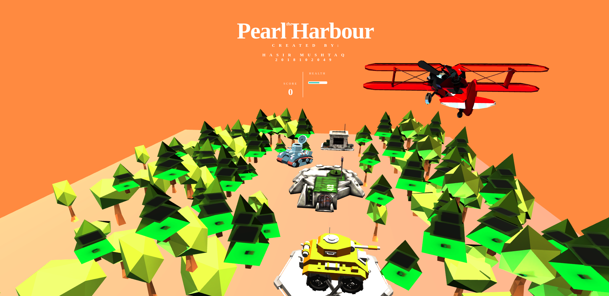
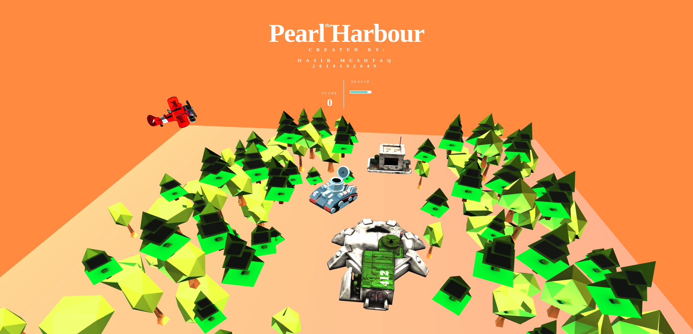

# Pearl Harbour WebGL Game
> A single-player fighter plane game built using WebGL. 

The game has the following features: 

1. Move around as a plane using W, A, S, D Keys.
2. Start engine of the plane with Z Key.
3. Drop bombs to destroy enemy base using Space Key.
4. Kill as many enemies before your health wears out.

## Steps to Start Playing
Just open the index.html file in your browser.

## Screenshots

  
   

## Game Trailer
https://drive.google.com/file/d/1zjWdf65rSimhTONa8KnUx9-HEencLGte/view?usp=sharing